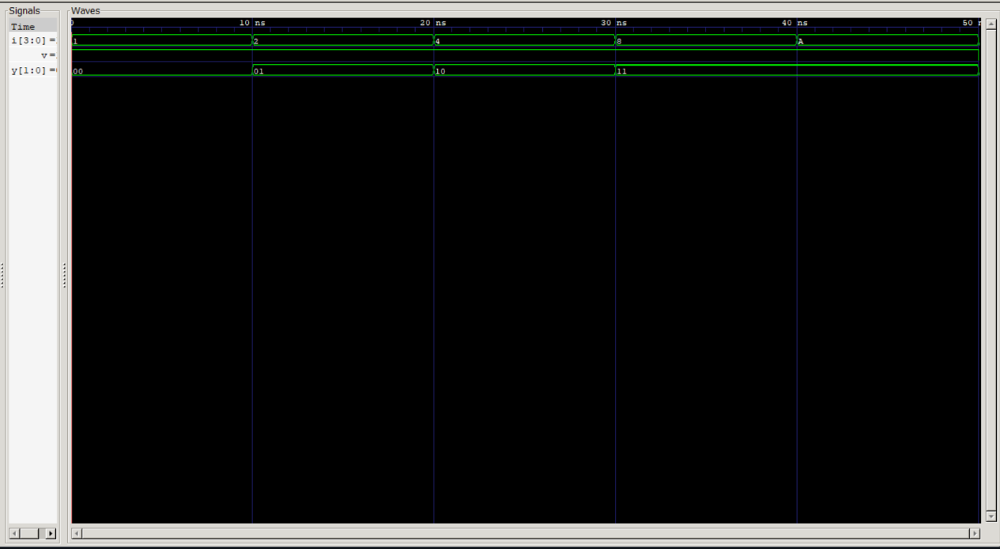
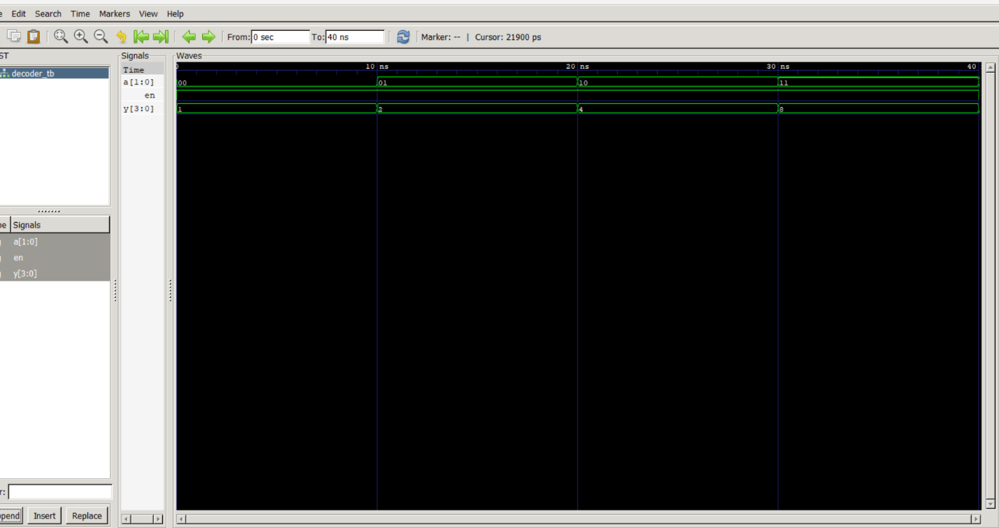

# **Lab 3: Implementation and Verification of Encoder and Decoder Circuits Using VHDL**

---

## **1. Objective**

The objectives of this experiment are:

* To design a **4-to-2 Priority Encoder** using VHDL.
* To design a **2-to-4 Decoder** using VHDL.
* To simulate both circuits and verify their outputs through waveform analysis.
* To understand the role and applications of encoding and decoding circuits in digital systems.

---

## **2. Theory**

### **2.1 4-to-2 Priority Encoder**

An **encoder** is a combinational logic circuit that converts multiple input signals into a smaller binary code at the output. A **4-to-2 encoder** accepts four input lines and generates a 2-bit binary output corresponding to the active input.

A **priority encoder** is a specialized encoder in which each input is assigned a priority level. If multiple inputs become active simultaneously, the encoder produces the binary code of the input with the highest priority while ignoring the others. This eliminates ambiguity and ensures predictable circuit operation.

For a 4-to-2 priority encoder, the priority order is:

**I₃ > I₂ > I₁ > I₀**

#### **Truth Table of 4-to-2 Priority Encoder**

| I₃ | I₂ | I₁ | I₀ | Y₁ | Y₀ |
| -- | -- | -- | -- | -- | -- |
| 0  | 0  | 0  | 1  | 0  | 0  |
| 0  | 0  | 1  | X  | 0  | 1  |
| 0  | 1  | X  | X  | 1  | 0  |
| 1  | X  | X  | X  | 1  | 1  |

*X = Don't Care*

---

### **2.2 2-to-4 Decoder**

A **decoder** performs the reverse operation of an encoder. It accepts a binary input and activates one corresponding output line among several possible outputs.

A **2-to-4 decoder** uses a 2-bit input and generates four output lines. Depending on the binary input value, only one output becomes HIGH while the remaining outputs remain LOW.

Decoders are widely used in:

* Memory selection
* Address decoding
* Control systems
* Data routing applications

#### **Truth Table of 2-to-4 Decoder**

| A₁ | A₀ | Y₃ | Y₂ | Y₁ | Y₀ |
| -- | -- | -- | -- | -- | -- |
| 0  | 0  | 0  | 0  | 0  | 1  |
| 0  | 1  | 0  | 0  | 1  | 0  |
| 1  | 0  | 0  | 1  | 0  | 0  |
| 1  | 1  | 1  | 0  | 0  | 0  |

---

## **3. Results**

### **3.1 Encoder Simulation**

---

### **3.2 Decoder Simulation**

---

### **Observation**

The simulation waveforms demonstrated that both the encoder and decoder produced outputs consistent with their respective truth tables. All input combinations generated the expected outputs, confirming the correctness of the VHDL designs.

---

## **4. Discussion**

This experiment focused on the implementation and verification of encoding and decoding circuits using VHDL.

The **4-to-2 Priority Encoder** successfully converted active input signals into their corresponding binary representations. When multiple inputs were active simultaneously, the encoder correctly selected the highest-priority input according to the predefined priority sequence (**I₃ > I₂ > I₁ > I₀**), ensuring a unique and reliable output.

The **2-to-4 Decoder** performed the reverse operation by converting a 2-bit binary input into one active output line. For every input combination, the appropriate output was asserted while all other outputs remained inactive.

Simulation waveforms generated using **GHDL** and analyzed with **GTKWave** confirmed the correct functionality of both circuits. The observed outputs matched the theoretical values for all test cases, demonstrating the accuracy and reliability of the VHDL implementations.

---

## **5. Conclusion**

The **4-to-2 Priority Encoder** and **2-to-4 Decoder** were successfully designed, implemented, and simulated using VHDL. The simulation results verified that both circuits operated according to their respective truth tables. This experiment strengthened the understanding of combinational logic design and highlighted the importance of encoders and decoders in digital communication, data processing, memory addressing, and control applications.

---

**Result:** The objectives of the experiment were successfully achieved, and the VHDL implementations were verified through simulation.
