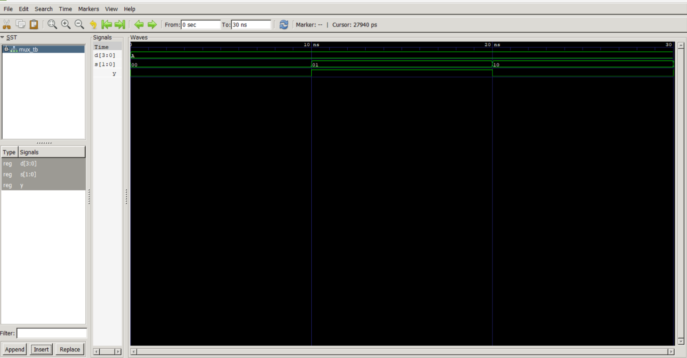
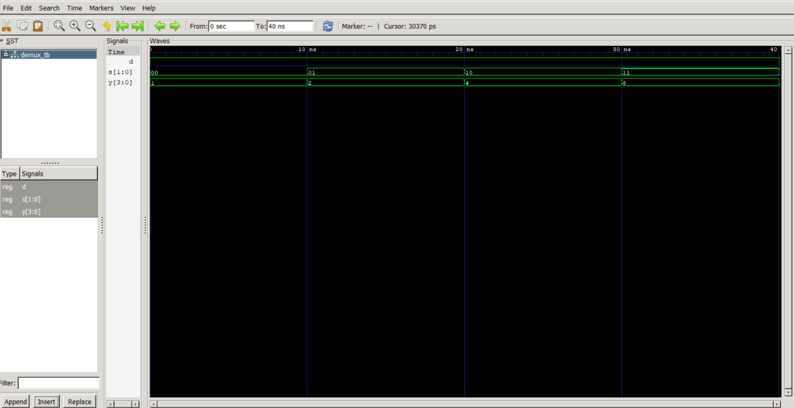

# Lab 4: Design and Simulation of Multiplexer and Demultiplexer Using VHDL

## Objective

* Design a 4-to-1 Multiplexer (MUX) using VHDL.
* Design a 1-to-4 Demultiplexer (DEMUX) using VHDL.
* Verify the functionality of both circuits through simulation.

## Theory

### 4-to-1 Multiplexer (MUX)

A multiplexer is a combinational circuit that selects one input from multiple available inputs and forwards it to a single output line. The selection is controlled using select signals.

For a 4-to-1 multiplexer:

* Inputs: D0, D1, D2, D3
* Select Lines: S1, S0
* Output: Y

#### Truth Table

| S1 | S0 | Output (Y) |
| -- | -- | ---------- |
| 0  | 0  | D0         |
| 0  | 1  | D1         |
| 1  | 0  | D2         |
| 1  | 1  | D3         |

---

### 1-to-4 Demultiplexer (DEMUX)

A demultiplexer performs the reverse operation of a multiplexer. It takes a single input signal and directs it to one of several output lines based on the select lines.

For a 1-to-4 demultiplexer:

* Input: D
* Select Lines: S1, S0
* Outputs: Y0, Y1, Y2, Y3

#### Truth Table

| S1 | S0 | Active Output |
| -- | -- | ------------- |
| 0  | 0  | Y0 = D        |
| 0  | 1  | Y1 = D        |
| 1  | 0  | Y2 = D        |
| 1  | 1  | Y3 = D        |

## Output / Results

### Multiplexer Simulation Output

### Demultiplexer Simulation Output

## Implementation Notes

The multiplexer and demultiplexer were implemented using VHDL dataflow modeling. The MUX selects one of the four inputs based on the select lines, while the DEMUX routes a single input to one of the four outputs.

Both designs were simulated using GHDL, and waveforms were observed using GTKWave to validate functionality.

## Discussion

The 4-to-1 multiplexer correctly forwarded the selected input to the output depending on the values of the select lines. The simulation results matched the theoretical truth table, confirming correct behavior.

The 1-to-4 demultiplexer successfully routed the input signal to the appropriate output line while keeping all other outputs inactive. This confirmed that the select signals properly controlled output distribution.

These results demonstrate how multiplexers and demultiplexers are essential components in digital systems for efficient data routing, signal management, and resource sharing.

## Conclusion

* Successfully implemented a 4-to-1 Multiplexer and a 1-to-4 Demultiplexer using VHDL.
* Verified correct operation through simulation and waveform analysis.
* Observed proper selection and routing behavior in MUX and DEMUX circuits.
* Strengthened understanding of combinational logic design using VHDL.