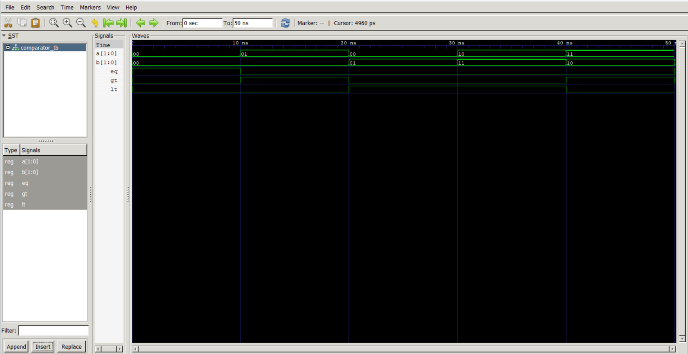

# Lab 5: VHDL Implementation of a 2-bit Magnitude Comparator

## Objective

- To design and simulate a 2-bit magnitude comparator using VHDL.
- To learn how digital circuits perform comparison operations between binary numbers.

---

## Theory

A magnitude comparator is a combinational logic circuit that compares two binary inputs and produces three output signals based on their relationship:

- **EQ (Equal):** Becomes HIGH when both inputs are equal (**A = B**).
- **GT (Greater Than):** Becomes HIGH when **A** is greater than **B** (**A > B**).
- **LT (Less Than):** Becomes HIGH when **A** is less than **B** (**A < B**).

For two 2-bit binary numbers, where:

- **A = A₁A₀**
- **B = B₁B₀**

The Boolean expressions are:

```text
EQ = (A₁ ⊙ B₁) · (A₀ ⊙ B₀)

GT = (A₁ · B₁') + ((A₁ ⊙ B₁) · A₀ · B₀')

LT = (A₁' · B₁) + ((A₁ ⊙ B₁) · A₀' · B₀)
```

Where:

| Symbol | Meaning |
|--------|---------|
| ⊙ | XNOR operation |
| ' | NOT (complement) |
| · | AND operation |
| + | OR operation |

---

## Expected Output

| A | B | EQ | GT | LT |
|---|---|:--:|:--:|:--:|
| 00 | 00 | 1 | 0 | 0 |
| 01 | 00 | 0 | 1 | 0 |
| 00 | 01 | 0 | 0 | 1 |
| 10 | 11 | 0 | 0 | 1 |
| 11 | 10 | 0 | 1 | 0 |
| 11 | 11 | 1 | 0 | 0 |

---

## Simulation Output

### Simulation Result

```markdown

```

---

## Conclusion

The 2-bit magnitude comparator was implemented and verified successfully in VHDL. The simulation confirmed that the circuit accurately compared the two 2-bit inputs and generated the appropriate **EQ**, **GT**, and **LT** outputs for every test case. This experiment demonstrated the practical implementation and verification of combinational logic circuits using VHDL.